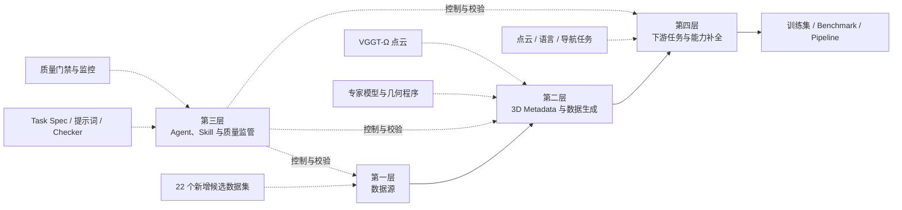
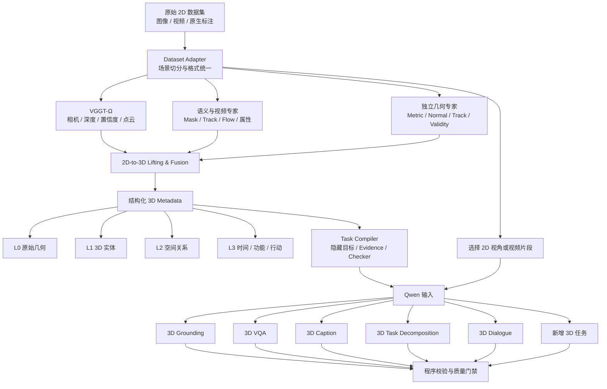
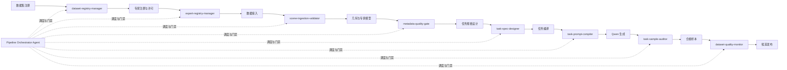
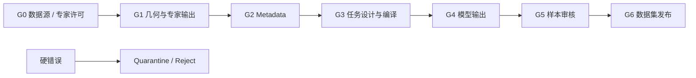
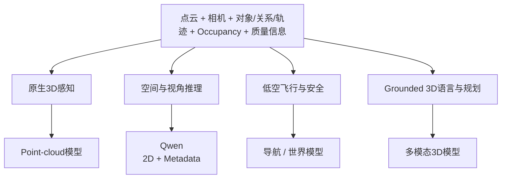

# 低空无人机 2D → 3D 数据生成项目

> **本文档是项目推进的追踪入口。** 想知道「还有什么要做、做到哪了」看下方进度表；
> 想知道「具体改了什么」看 `docs/CHANGELOG.md`。
>
> 当前阶段：第一层完成，第二层卡在 VGGT-Ω 权重，周边机器建设中  
> 对应主规格：`docs/CLAUDE_CODE_PROJECT_SPEC.md` v0.2.0  
> 最近更新：2026-08-25

## 📋 进度追踪表

> **这是持续追踪用的主表。** 每次交付后更新状态，具体改动记录在 `docs/CHANGELOG.md`，不写进本表。
> 来源标记：**用户** = 你提出的 ｜ **商讨** = 讨论后共同确定 ｜ **建议** = Agent 依据 SPEC 判断应做

### 🔴 受阻（需要你处理）

| # | 需求 | 来源 | 阻塞原因 |
|---|---|---|---|
| R-01 | VGGT-Ω 几何重建（L2-S1） | 商讨 | **M-007** 权重需 HF 账号申请，已提交待批。这一项卡住第二层 S1 及其全部下游 |
| R-02 | 米制尺度精度验证 | 商讨 | **M-008** 需 `calibration_results.py`（相机-LiDAR 外参），只在 OneDrive/GDrive 完整版根目录。没有它 `domain_calibrated` 无法置位，绝对米制任务不解锁 |

### 🟡 待办（现在就能做，按建议优先级）

| # | 需求 | 来源 | 补的是四层里的哪块 |
|---|---|---|---|
| R-10 | `task-prompt-compiler` 离线编译 | 建议 | **L2-S6**。把 Task Spec 从"能通过静态校验的 YAML"变成可执行产线；补上**运行时**泄漏检查（现在只有静态的） |
| R-11 | `scene-ingestion-validator` | 建议 | 第三层第一道闸门（L2-S0→S1）。现在 adapter 产出的场景 `gate_status` 是 `None`，无人检查。可把基线/帧数退化在接入阶段拦掉 |
| R-12 | 专家模型产出真实 artifact | 建议 | **L2-S2 / S2B**。模型已部署但未接线，按 §14.8 I/O 契约存盘 |
| R-13 | `task-sample-auditor` | 建议 | **L2-S8**。checker 已备，缺调度与修复策略 |
| R-14 | Orchestrator 执行器 | 建议 | 第三层。状态机规则已实现并测试，缺驱动它的执行器 |
| R-15 | G1–G6 质量门禁 | 建议 | 第三层。目前只有 G0 手工走过一次 |
| R-16 | Canonical Task Record + 三类 adapter | 建议 | **第四层**。`pointcloud_native` 是 3D-GRPO 的直接消费接口 |
| R-17 | SEA-RAFT / CABiNet 部署 | 建议 | L2-S2。权重不在 HF，需找官方渠道。SEA-RAFT 的残差光流最终仍需 R-01 |
| R-18 | 能力覆盖矩阵 | 建议 | 第四层。防止不同题型重复测同一能力 |
| R-19 | 其余 21 个候选数据集建卡 | 建议 | 第一层，Phase 2 |

### ⏸️ 暂缓（已决定推迟）

| # | 需求 | 来源 | 说明 |
|---|---|---|---|
| R-20 | Qwen 部署与调用 | 商讨 | 首批只编译 prompt bundle 不调模型；到 vertical slice 第 11 步前重新确认 |
| R-21 | LLM Judge | 建议 | 首版只用确定性 checker |
| R-22 | DSINE 独立法向 | 建议 | 优先级下降 —— MoGe-3 已提供独立法向 |
| R-23 | 飞书清单去重 | 用户 | 仅 Phase 2 扩数据集时才需要（M-004） |

### ✅ 已完成

| # | 需求 | 来源 | 产出 |
|---|---|---|---|
| R-30 | 设计改动立即同步文档 | 用户 | `CLAUDE.md` 规则 1 + 文档职责映射表 |
| R-31 | 占卡程序保持挂载 | 用户 | `CLAUDE.md` 规则 2 |
| R-32 | 显卡监听守护程序 | 用户 | `scripts/gpu_guard.sh`，20 分钟一轮，实测自动拉起 |
| R-33 | 人工输入登记簿 | 用户 | `docs/MANUAL_INPUTS.md` + `secrets/` 自屏蔽目录 |
| R-34 | 变更日志 | 用户 | `docs/CHANGELOG.md`，六类标签，只追加不改写 |
| R-35 | 待删除清单（Agent 不执行删除） | 用户 | `docs/PENDING_DELETIONS.md` |
| R-36 | 同步到独立 GitHub 仓库 | 用户 | `NewNiuuu/3D-pointcloud-data-pipeline` |
| R-37 | Blob 数据路径登记 | 用户 | `MANUAL_INPUTS.md` §3，D-001/D-002 含实测结构 |
| R-38 | 调研结果另记简明文档 | 用户 | `docs/FINDINGS.md`，结论先行 |
| R-39 | 项目专属 conda 环境 | 用户 | `nyp-3dpipe` + `nyp-moge`；`CLAUDE.md` 规则 3 |
| R-40 | 修正 git 提交作者 | 用户 | 9 个提交改写，仓库级身份固化 |
| R-41 | README 作为追踪文档 | 用户 | 本表 |
| R-42 | 四项实施边界决策 | 商讨 | 首批数据集 / metric 政策 / 首批任务 / Qwen 暂缓 |
| R-43 | 数据许可政策 | 商讨 | 接受 CC BY-NC-SA 4.0 学术用途 |
| R-44 | 项目定位与 3D-GRPO 关系 | 商讨 | 产出「点云 + 任务标注」一对；3D-GRPO 是下游训练框架 |
| R-45 | 首批数据集获取与 G0 | 建议 | UAVScenes 35 GB；card / 许可 / 文件清单 |
| R-46 | 冻结契约（vertical slice 1） | 建议 | `core/`：ID、状态机、枚举、57 错误码、artifact 血缘 |
| R-47 | Dataset Adapter（vertical slice 2） | 建议 | `adapters/uavscenes/`，3 个场景落盘 |
| R-48 | 确定性几何 + checker（vs 7） | 建议 | `geometry/` 17 函数 + `checkers/` 4 个 |
| R-49 | Task Spec（vertical slice 8） | 建议 | 4 个，覆盖 3 个任务族 |
| R-50 | 专家模型许可核验与部署 | 用户 | 9 张专家卡；7 个已部署验证 |
| R-51 | 现有点云语料分析 | 用户 | `docs/BASELINE_POINTCLOUD_ANALYSIS.md` |
| R-52 | VGGT-Ω 部署与输出契约 | 用户 | 代码就绪；输出契约实测确认 |
| R-53 | 尺度转换关系调查 | 用户 | `docs/SCALE_RECOVERY_ANALYSIS.md`。**结论：数学成立但精度受重建稳定性限制** |
| R-54 | 基线阈值定准 | 用户 | **结论是定不出来** —— 推翻了此前两条结论，详见 §C |

---

## 文档维护规则

`CLAUDE_CODE_PROJECT_SPEC.md` 是 Agent 实施依据，本 README 是人类阅读入口。

**README 的职责是追踪「还有什么要做、做到哪了」，不是记录「改了什么」。**
具体改动一律记入 `docs/CHANGELOG.md`，不要往 README 里堆。

以下情况**必须**更新 README 的进度追踪表：

- 新需求产生（无论来自用户、商讨还是 Agent 判断）→ 加一行，标明来源；
- 需求状态变化（待办 → 完成 / 受阻 / 暂缓）→ 改状态并补产出或阻塞原因；
- 阻塞项解除或新增；
- 四层架构任一层的阶段状态变化。

以下情况**必须**更新 README 正文：

- 数据集新增、删除、评级或验证状态变化；
- Pipeline 阶段、数据流或模型职责变化；
- 质量门禁或关键技术路线变化。

## 项目目标

利用低空无人机 2D 图像/视频生成点云和结构化 3D metadata，再让 Qwen 基于 **2D 视觉输入 + 3D metadata** 生成可验证的三维场景理解数据。



固定原则：

- 点云主路径是 **VGGT-Ω**。
- Qwen 不直接读取点云。
- 几何真值优先由程序计算，LLM 不负责创造真值。
- 任务必须真实依赖三维信息。
- metric 与 relative scale 严格区分。

---

## 第一层：数据集来源

### 当前统计

| 项目 | 数量 |
|---|---:|
| 新增候选 | 22 |
| S 级 | 7 |
| A 级 | 7 |
| B 级 | 6 |
| C 级 | 2 |
| 实拍 | 12 |
| 仿真 | 7 |
| 实拍 + 仿真 | 3 |

飞书历史清单已有：FloodNet、Open3DVQA、TDBench、LADI-v2、AVI-Math、AirCopBench、SpatialSky、UrbanVideo-Bench、MM-UAVBench、MME-RealWorld、Geo3DVQA。以下 22 个候选是在该历史快照基础上新增的。

### 新增数据集清单

| 级别 | 数据集 | 类型 | 主要特点 | 下一步用途 |
|---|---|---|---|---|
| S | UAVScenes | 实拍 | RGB、Livox、6DoF 位姿、标定、语义点云/网格 | 真实语义几何与首批闭环候选 |
| S | Dronescapes | 实拍 | 视频、SfM 位姿/内参、度量深度、法向 | 真实多视角重建候选 |
| S | H3D | 实拍 | 高密度 LiDAR、标注点云、纹理网格 | 高质量 3D 监督与评测参考 |
| S | SkyLume | 实拍 | 五向相机、RTK 重复飞行、COLMAP、LiDAR/网格 | 重复航线与跨时相研究 |
| S | UAVStereo | 混合 | 立体 RGB、视差、网格/LiDAR 几何 | 立体深度和尺度验证 |
| S | UrbanScene3D | 混合 | LiDAR、网格、多套影像/位姿、仿真标签 | 真实—仿真联合研究 |
| S | ClaraVid | 仿真 | 度量深度、语义/实例/动态 mask、相机、点云 | 完整标签与受控实验 |
| A | NTU VIRAL | 实拍 | 双相机、双 LiDAR、IMU、UWB、Leica 真值 | 传感器、位姿和尺度验证 |
| A | MUN-FRL | 实拍 | RGB、LiDAR、IMU、RTK-GNSS | 真实 metric 场景 |
| A | MARS-LVIG | 实拍 | RGB、Livox、IMU、GNSS/RTK、地图真值 | 真实度量几何 |
| A | Mid-Air | 仿真 | 深度、法向、语义、视差、遮挡、位姿 | 可控几何和遮挡任务 |
| A | UAV3D | 仿真 | 多机多视角、像素语义、3D box | 多视角对象任务 |
| A | U2UData+ | 仿真 | 多机 RGB + LiDAR、3D box/track | 协同感知与轨迹任务 |
| A | IllumUAV-Sim | 仿真 | 昼夜对齐 RGB、深度、法向、相机参数 | 光照鲁棒性测试 |
| B | UAPD / DAPM | 仿真 | RGB、深度、随机高度/姿态/FOV | 视角变化任务 |
| B | UAVPairs | 实拍 | 高重叠多视角、SfM 匹配关系 | Cross-view Correspondence |
| B | UAVID3D | 实拍 | RGB + 热红外、环绕影像、GPS | 多模态重建候选 |
| B | Ready for 3D Reconstruction | 实拍 | GCP、MVS、TLS 点云 | 重建和尺度评估 |
| B | FlyAwareV2 | 混合 | RGB、深度、语义；实拍含伪深度 | 障碍任务，需严格标记深度来源 |
| B | LAMBDA | 仿真 | RGB、LiDAR、4D radar、CSI、IMU、多机 | 后续多模态扩展 |
| C | UAVid | 实拍 | 4K 视频、8 类语义，几何较弱 | 语义专家与视频辅助数据 |
| C | VisDrone | 实拍 | 大规模检测/跟踪框，无深度和位姿 | 2D 专家训练或辅助任务 |

### 下一步

1. 重新只读核对最新飞书清单。
2. 为 22 个候选建立机器可读 Dataset Card。
3. 核验链接、许可、文件和尺度来源。
4. 每个首选数据集只下载 1–3 个场景样本。
5. 最终选择 1–2 个互补数据集跑通闭环。

---

## 第二层：3D Metadata 与数据生成 Pipeline



### Metadata 分层

| 层级 | 核心内容 | 首版策略 |
|---|---|---|
| L0 原始几何 | 相机、深度、点云、法向、坐标系、尺度 | 必做 |
| L1 3D 实体 | 稳定 ID、centroid、OBB、可见性、对象/部件/轨迹 | 必做对象级字段 |
| L2 3D 关系 | 距离、方向、高差、遮挡、连接、拓扑 | 按首批任务实现 |
| L3 时间与行动 | 轨迹、TTC、自由空间、路线、Next-best-view | 后续按需扩展 |

### 模型的正确职责

| 类型 | 真值来源 | Qwen 的作用 |
|---|---|---|
| Grounding / metric VQA / correspondence | 几何程序、原生标注 | 理解问题并输出结构化答案 |
| Caption / Dialogue | 程序生成的 claims 与状态 | 组织语言、组合事实、保持对话状态 |
| Task Decomposition / 规划 | 模型候选 + 几何规则验证 | 生成计划候选和解释 |

### 当前推荐的首版专家组合

> 已完成官方资料调研，尚未下载 checkpoint，也未在本地 UAV 数据上实测。

| 功能 | 当前首选 | 在 Pipeline 中的作用 |
|---|---|---|
| 开放词汇实例 mask | Grounded-SAM-2 | 检测候选、类别和像素级实例 mask |
| 视频 mask tracking | SAM 2.1 Base+ | 跨帧传播 mask 和 2D track ID |
| 光流与动态证据 | SEA-RAFT | 生成 flow/uncertainty；扣除相机自运动后判断动态区域 |
| 天空、水面和 stuff | OneFormer | 生成独立的无效几何原因 mask |
| UAV 障碍语义 | CABiNet MobileNetV3-Small | 补充低空障碍、地表和植被语义 |
| 独立 metric 几何 | MoGe-3 ViT-L | 当前优先的尺度、法向、valid mask 和细节第二意见 |
| 独立法向 | DSINE | 避免所有法向都由深度微分产生；启用前审查许可 |
| 深度/位姿复核 | DA3 / DA3-1.1 | 提供第二份深度、相机、sky 和尺度意见；不融合其点云为真值 |
| 长视频几何 | DA3-Streaming | 分段 pose/depth/confidence 和 loop closure；仅长视频启用 |
| 点轨迹与可见性 | CoTracker3 | 提供 2D tracks/visibility；当前许可限制生产使用 |
| 属性与描述候选 | Florence-2 | 对稳定实例生成受约束的属性和描述候选 |
| 跨视角外观特征 | DINOv2 Small/Base | ReID、聚类和跨视角关联 |
| 电线专项 | PowerLine-MTYOLO Nano | 电力线 mask；仅作领域专项证据 |

三个重要规则：

- 光流幅值不等于物体运动，必须先扣除 VGGT-Ω 深度和相机运动产生的静态流。
- `sky`、`water`、`reflection`、`low_depth_confidence`、`dynamic_geometry` 等原因必须分别保存。
- 可飞行空间不能由 2D 模型直接决定，必须在 3D occupancy/free-space 中结合无人机尺寸和安全裕量计算。
- 多模型不能投票产生真值；必须先对齐、计算残差，再形成置信度、弱标签或复核标志。
- WorldMirror 目前只能用于推理/评估，不能把输出作为 Qwen 训练 metadata。

几何专家接入顺序：`MoGe-3 → DSINE → DA3-1.1 → DA3-Streaming（长视频）→ Trace Anything（动态）`。WorldMirror最后作为独立评估或受控修复实验。

| 深度类型 | 能否直接生成米制任务 |
|---|---|
| Metric | 通过 UAV 域尺度校准后才可以 |
| 外部锚定 | 锚点和误差记录完整时可以 |
| Relative / Affine-invariant | 不可以 |
| Pseudo depth | 只能作弱标签或质量信号 |

---

## 第三层：Agent、Skill 与质量监管

> 当前状态：下列 Skill 已完成架构定义，**尚未创建和实现**。



### Skill 作用表

| Skill | Pipeline 位置 | 目的 | 主要输出 |
|---|---|---|---|
| `dataset-registry-manager` | 数据集调研与选择 | 去重、维护 Dataset Card、核验数据和许可 | 数据集注册表与选择建议 |
| `expert-registry-manager` | 专家模型启用之前 | 核验代码/权重许可、checkpoint、能力、输入输出和 UAV 验证状态 | 专家卡、启用清单与运行策略 |
| `scene-ingestion-validator` | Adapter 之后 | 检查文件、标定、时间戳、尺度和 split | 接入验证报告 |
| `metadata-quality-gate` | 3D 融合之后 | 检查坐标系、ID、几何一致性、来源和置信度 | 合格 metadata snapshot |
| `task-spec-designer` | 下游任务设计阶段 | 将点云和metadata能力映射为可验证、具备3D及低空特性的任务规格 | Task Spec与能力覆盖矩阵 |
| `task-prompt-compiler` | Qwen 调用之前 | 根据 Task Spec 生成任务提示词、隐藏目标和 Checker | Prompt Bundle |
| `task-sample-auditor` | Qwen 返回之后 | 检查答案、证据、泄漏、歧义和幻觉 | 合格样本或隔离记录 |
| `dataset-quality-monitor` | 批次与发布阶段 | 监控分布、重复、通过率、漂移和 3D 依赖性 | Dashboard 与发布清单 |

### 质量门禁



每个阶段只有四种状态：`pass`、`warn`、`quarantine`、`reject`。硬错误不能通过“综合评分较高”被抵消。

关键监控指标：

- Checker 一致率；
- target 泄漏率；
- 无依据内容率；
- 歧义样本率；
- 重复与模板坍缩率；
- 格式修复和重新生成率；
- 数据集、任务、难度、真实/仿真分布；
- `2D-only` 与 `2D+metadata` 的性能差异；
- metadata shuffle / masking / counterfactual 后的性能变化。

---

## 第四层：下游任务与能力补全

最终任务标注采用统一格式，同时服务三类模型：



### 能够生成的任务

| 任务方向 | 代表任务 | 主要3D标注 | 补充的能力 |
|---|---|---|---|
| 原生3D感知 | 语义/实例分割、3D检测、3D tracking | 点标签、实例点集、OBB、轨迹 | 航拍视角下的点云感知 |
| 原生3D感知 | 电线/树枝grounding、中心线和连通性 | point mask、centerline、端点、置信度 | 传统3D数据缺少的细线障碍 |
| 度量与空间关系 | 距离、高度、角度、左右前后、拓扑 | 相机位姿、对象几何、关系图 | metric和observer-relative推理 |
| 跨视角与可见性 | correspondence、遮挡、最佳视角 | 2D observation↔3D object、visibility | 大视角变化和主动观察 |
| Occupancy与飞行空间 | free/occupied/unknown、flyable volume | voxel、ESDF、可飞行体积 | 开放空域和unknown-space理解 |
| 路线与安全 | route feasibility、clearance、瓶颈 | route、最近障碍、最小净空 | 低空飞行约束和薄障碍避让 |
| 动态风险 | 3D trajectory、TTC、碰撞风险 | 轨迹、速度、协方差、swept volume | 去除无人机自运动后的动态理解 |
| Active Perception | Next-best-view、检查视角规划 | 候选pose、可见性增益、移动成本 | 主动补观测和覆盖规划 |
| Grounded 3D语言 | Grounding、VQA、Caption、Dialogue | 稳定ID、点/框/线/区域目标 | 语言与真实三维实体绑定 |
| 任务与计划 | Task Decomposition、Plan Critique | waypoint、约束、前置/完成条件 | 可执行且可验证的空间计划 |
| Metadata与Scene Graph | Verification、Completion、Query | 字段、节点、关系、证据 | 发现错误、补全和查询三维知识 |
| 变化与反事实 | 3D Change、Viewpoint Transformation | 跨时对象状态、修改后的几何关系 | 长期变化和空间反事实推理 |

### 任务设计要求

每个任务必须：

- 映射到点索引、OBB、中心线、体素、相机位姿、轨迹或路线等具体3D目标；
- 证明不能只靠单张2D图像稳定解决；
- 对宣称“低空特色”的任务使用飞行位姿、高度、薄障碍、可飞行空间、航迹、动态风险或主动视角信息；
- 保存隐藏target、evidence、derivation program和checker；
- 标记监督等级：强监督、程序派生、过滤伪标签、弱标签或语言生成；
- 在尺度或几何不足时输出`unknown`、区间或拒答，而不是伪造答案。

任务优先级：

1. 先做可移植的基础标注：3D分割、Grounding、metric/situated VQA、cross-view、visibility和uncertainty。
2. 再做项目的低空差异化能力：薄障碍、flyable volume、clearance、route、TTC和Next-best-view。
3. 最后扩展Caption、Dialogue、Task Decomposition、Scene Graph和长期变化推理。

---

## 当前进度（按四层架构，2026-08-25）

### 第一层：数据源注册与选择

| 环节 | 状态 |
|---|---|
| 首批数据集选定 | ✅ UAVScenes（用户确认） |
| Dataset Card + 许可审查 + 文件清单 | ✅ `registry/datasets/uavscenes/` |
| G0 门禁 | ✅ `pass_with_constraints`（CC BY-NC-SA 4.0） |
| 小样本落盘与结构核验 | ✅ 35 GB，20 run / 4 split group，帧级契约已实测 |
| 其余 21 个候选建卡 | ⬜ 未做（Phase 2） |
| `dataset-registry-manager` Skill | ⬜ 规则已在文档，未落为 Skill |

**这一层对首批数据集已经走完。**

### 第二层：2D→3D Metadata 提取与场景构建

| 阶段 | 内容 | 状态 |
|---|---|---|
| L2-S0 | Dataset Adapter / 场景切分 | ✅ `adapters/uavscenes/`，3 个场景已落盘 |
| L2-S1 | **VGGT-Ω 几何重建** | ❌ **权重待批（M-007）—— 本层的卡点** |
| L2-S2 | 2D/视频专家推理 | ⚠️ 模型已部署验证，**尚未产出 artifact** |
| L2-S2B | 独立几何专家 | ⚠️ 同上（MoGe-3 / DA3 已跑通） |
| L2-S3 | 2D→3D 提升与融合 | ❌ 依赖 S1 的深度 |
| L2-S4 | Metadata 派生 | ⚠️ 几何函数已备（`geometry/`），无输入可派生 |
| L2-S5 | 质量与 provenance | ⚠️ artifact 信封已备（`core/artifact.py`），门禁未实现 |
| L2-S6 | **Task 编译** | ⬜ 未开始 ← `task-prompt-compiler` |
| L2-S7 | 模型生成 | ⏸️ 按决策暂缓 |
| L2-S8 | 样本校验 | ⚠️ checker 已备，auditor 未实现 |

**这一层卡在 S1。** S0 完成，S2/S2B 的模型就位但没接线，S3–S5 全部等 S1 的深度。

### 第三层：Agent、Skill、编译、校验与质量监管

| 内容 | 状态 |
|---|---|
| 冻结契约（ID / 状态机 / 枚举 / 57 错误码 / artifact 血缘） | ✅ `core/` |
| 8 个 Skill | ⬜ **0 个已建目录**；部分规则已硬编码进 `core/task_spec.py` 与 `checkers/` |
| 质量门禁 G0 | ⚠️ UAVScenes 手工走过，未实现为可复用门禁 |
| 质量门禁 G1–G6 | ⬜ 未实现 |
| Orchestrator 状态机 | ⚠️ 迁移规则已实现并测试，**驱动它的执行器未写** |

**这一层有骨架无肌肉**：契约与规则都在，但没有一个 Skill 真正跑起来。

### 第四层：下游任务设计与能力补全

| 内容 | 状态 |
|---|---|
| Task Spec | ✅ 4 个，覆盖用户确认的 3 个任务族 |
| 确定性推导程序与 checker | ✅ `geometry/` 17 个函数 + `checkers/` 4 个 |
| 输出 schema | ✅ `schemas/answers/` 4 个 |
| Canonical Task Record | ⬜ 契约在 SPEC §41，未实现 |
| 三类 adapter（qwen / pointcloud_native / multimodal_3d） | ⬜ Spec 中已声明，未实现 |
| 能力覆盖矩阵 | ⬜ 未做 |

**这一层的"配方"齐了，"产线"没建。**

### 一句话总结

**第一层走完，第四层定好了规格，第三层有契约无执行，第二层卡在 VGGT-Ω 权重。**
当前所有可推进的工作都在"等权重期间把周边机器造好"这个范畴内。

### 阻塞项

| 编号 | 内容 | 影响 |
|---|---|---|
| M-007 | VGGT-Ω 权重（已申请） | 第二层 S1 及其下游全停 |
| M-008 | 相机-LiDAR 标定文件 | 米制精度无法验证，`domain_calibrated` 无法置位 |

### 已产出代码与产物

```text
core/            冻结契约：ID 命名空间、状态机、枚举、57 个错误码、artifact 信封、Task Spec 加载器
geometry/        17 个确定性几何函数（任务真值的唯一来源）
checkers/        4 个确定性 checker（独立重算 target，不采信样本存值）
adapters/        UAVScenes adapter（run 发现 / split group 归并 / 场景切分）
schemas/         归一化场景契约 + 4 个答案输出 schema
task_specs/      4 个 Task Spec，覆盖首批 3 个任务族
registry/        UAVScenes 的 dataset_card / license_review / file_inventory
scripts/         build_scenes.py CLI
tests/           141 项，全部通过
```

对应 SPEC §34 vertical slice 的第 1、2、7、8 步。**尚未接入模型，也未使用 GPU。**

| Spec | 族 | checker |
|---|---|---|
| `3d_grounding.object` | grounding | `check_object_grounding_answer` |
| `3d_vqa.metric.minimum_distance` | vqa | `check_minimum_distance_answer` |
| `3d_vqa.situated.observer_relative_direction` | vqa | `check_observer_relative_direction_answer` |
| `cross_view_correspondence.object` | cross_view | `check_cross_view_correspondence_answer` |

## 实施边界（2026-08-24 已确定）

| 项 | 决定 |
|---|---|
| 首批数据集 | **UAVScenes** 单个（真实多视角，含 Livox 点云与 6DoF 位姿）。**已下载 35 GB**，20 个 run / 4 个 split group |
| 是否强制 metric scale | **强制**。UAVScenes 每 run 带 RTK，锚点确认存在；relative / affine-invariant / pseudo 深度场景首版不具备任务资格 |
| 首批任务 | **3D Grounding（对象级）+ metric/situated 3D VQA + Cross-view Correspondence** |
| Qwen 版本与部署 | **暂缓**。首批只编译 prompt bundle、跑泄漏检查与 checker 复现，不调用模型 |
| 数据许可 | **接受 CC BY-NC-SA 4.0，仅学术用途**。衍生 metadata 与任务标注按演绎作品处理，发布时沿用同一许可并署名 MARS-LVIG 与 UAVScenes |
| 服务器调度框架 | 不绑定框架，脚本 + 文件状态机 |
| 质量阈值 | 沿用文档建议值，待真实数据后校准；首批样本 100% 人工复核 |

细节与理由见 `PROJECT_HANDOFF.md` §19，机器可读形式见 `CLAUDE_CODE_PROJECT_SPEC.md` §36。

### 环境现实约束

- 本地 `data/` 只有 QA 标注 JSON，**无图像/视频/点云**，且属飞书已有清单，不能作为本 Pipeline 的重建输入。
- UAVScenes 已下载至 `data_raw/UAVScenes`（**HF 镜像开放，无需 token**）；其余 21 个候选未落盘。
- HF 镜像仅含 **interval=5**（1/5 帧率）。降采样可能降低帧间重叠，影响 VGGT-Ω 重建质量，需实测；不足则改取 interval=1。
- VGGT-Ω 尚未安装，其可获取性需在 Layer 2 开工前核验。
- 需用户手动提供的凭证与材料统一登记在 `docs/MANUAL_INPUTS.md`（当前仅剩飞书导出一项待办）。

### 项目定位（2026-08-24 已澄清）

**本 Pipeline 的最终产物是一对交付物**：2D 数据集对应的**点云** + 该点云对应的**下游任务标注**。只生成点云不算完成。

- Blob 上 `Pointcloud-VQA/`、`PointCloud-grounding/` 中的点云，是同事已用 VGGT-Ω 转出的**最终点云结果**（对应 `data/` 那批数据集）。它们**也可以**作为生成下游标注的中间产物，是否纳入取决于后续任务设计。
- 同级 `3D-GRPO` 是本 Pipeline **下游的训练框架**：用产出的点云 + 任务标注做 SFT，再用 GRPO 训练自有点云理解模型。**当前与数据生成解耦**，无需为其调整排期。
- 因此 SPEC §39/§41 三类 adapter 中，`pointcloud_native` 有了明确消费方，优先级不低于 `qwen_2d_metadata`。这不改变铁律 2/3 —— Qwen 仍只读 2D + metadata。

建议首批范围：UAVScenes 单数据集、对象级 L0/L1/L2 metadata、3D Grounding、metric/situated 3D VQA，加 Cross-view Correspondence。

## 文档入口

| 文件 | 阅读对象 | 用途 |
|---|---|---|
| `README.md` | 人类 | 项目方向、架构、数据集和当前状态 |
| `CLAUDE_CODE_PROJECT_SPEC.md` | Claude Code / Agent | 服务器实现的主规格 |
| `PROJECT_HANDOFF.md` | 人类与 Agent | 历史决策、调研依据和约束来源 |
| `AGENT_SKILL_SYSTEM_DESIGN.md` | Agent / 开发者 | Skill 与质量系统的详细设计草案 |
| `MANUAL_INPUTS.md` | 用户与 Agent | 需要用户手动提供的信息登记（token、凭证、许可申请、飞书导出）；只记位置不记真实值 |
| `CHANGELOG.md` | 用户与 Agent | 每一次改动的流水账：需求、决策、实现、文档同步、事实修正 |
| `PENDING_DELETIONS.md` | 用户 | 待删除内容与删除命令（Agent 不执行删除） |
| `BASELINE_POINTCLOUD_ANALYSIS.md` | 人类与 Agent | blob 上现有 VGGT-Ω 点云语料的实测分析：格式、尺度、任务形态 |
| `VGGT_OMEGA_DEPLOYMENT.md` | 人类与 Agent | VGGT-Ω 的可获取性、许可分层、环境部署与实测输出契约 |
| `EXPERT_DEPLOYMENT.md` | 人类与 Agent | 专家模型的许可核验、部署状态与实测；逐模型详情见 `registry/experts/` |
| `FINDINGS.md` | **人类** | 调研发现的简明摘要：结论、影响、详情链接 |
| `SCALE_RECOVERY_ANALYSIS.md` | 人类与 Agent | 相对深度如何锚定为米制、失效边界与基线阈值 |
